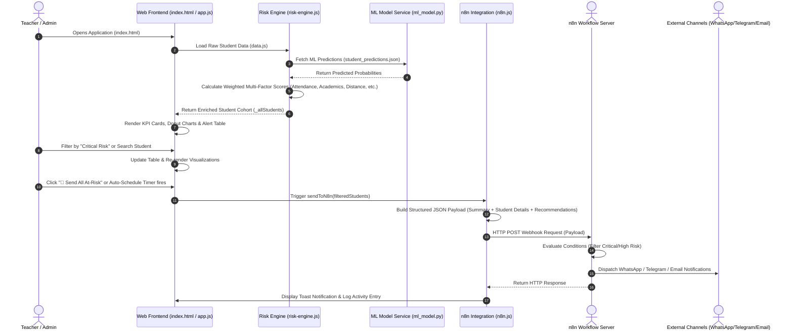
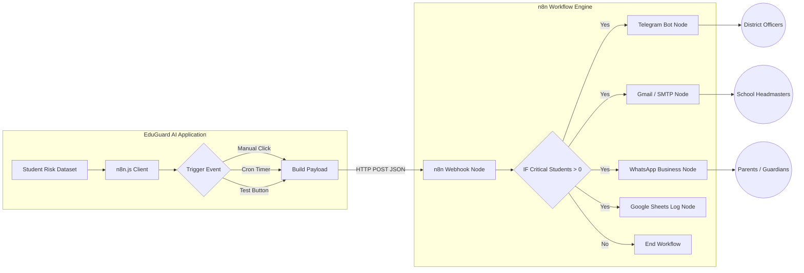

# EduGuard AI — System Architecture & Workflow Specifications

## 1. High-Level Architectural Layers

```
┌─────────────────────────────────────────────────────────────────────────────┐
│                          1. PRESENTATION LAYER (UI)                         │
│  ┌────────────────────────┐  ┌───────────────────────┐  ┌────────────────┐ │
│  │ Single Page App (SPA)  │  │ Theme Engine          │  │ AI Chatbot     │ │
│  │ (index.html, app.js)   │  │ Light / Dark / System │  │ (chatbot.js)   │ │
│  └────────────────────────┘  └───────────────────────┘  └────────────────┘ │
│  ┌────────────────────────┐  ┌───────────────────────┐  ┌────────────────┐ │
│  │ Chart.js Visualizer    │  │ Export Engine         │  │ Tutorial Modal │ │
│  │ (charts.js)            │  │ (jsPDF, CSV, Word)    │  │ (Walkthrough)  │ │
│  └────────────────────────┘  └───────────────────────┘  └────────────────┘ │
└─────────────────────────────────────────────────────────────────────────────┘
                                      │
                                      ▼
┌─────────────────────────────────────────────────────────────────────────────┐
│                       2. LOGIC & SERVICE LAYER                              │
│  ┌────────────────────────┐  ┌───────────────────────┐  ┌────────────────┐ │
│  │ Multi-Factor Risk      │  │ Intervention          │  │ School Cohort  │ │
│  │ Scoring (risk-engine)  │  │ Tracker (app.js)      │  │ Manager        │ │
│  └────────────────────────┘  └───────────────────────┘  └────────────────┘ │
└─────────────────────────────────────────────────────────────────────────────┘
                                      │
                                      ▼
┌─────────────────────────────────────────────────────────────────────────────┐
│                    3. MACHINE LEARNING & DATA LAYER                         │
│  ┌────────────────────────┐  ┌───────────────────────┐  ┌────────────────┐ │
│  │ Scikit-Learn ML Model  │  │ Pre-calculated JSON   │  │ Synthetic Data │ │
│  │ (Logistic Regression)  │  │ Predictions (ML)      │  │ Engine (data)  │ │
│  └────────────────────────┘  └───────────────────────┘  └────────────────┘ │
└─────────────────────────────────────────────────────────────────────────────┘
                                      │
                                      ▼
┌─────────────────────────────────────────────────────────────────────────────┐
│                    4. INTEGRATION & AUTOMATION LAYER                        │
│  ┌────────────────────────┐  ┌───────────────────────┐  ┌────────────────┐ │
│  │ n8n Webhook Client     │  │ Auto-Scheduler        │  │ Activity Log   │ │
│  │ (n8n.js)               │  │ Timer (setInterval)   │  │ Manager        │ │
│  └────────────────────────┘  └───────────────────────┘  └────────────────┘ │
└─────────────────────────────────────────────────────────────────────────────┘
                                      │ (HTTP POST Webhook)
                                      ▼
┌─────────────────────────────────────────────────────────────────────────────┐
│                     5. EXTERNAL AUTOMATION (n8n)                            │
│  ┌─────────────────┐ ┌─────────────────┐ ┌───────────────┐ ┌──────────────┐ │
│  │  WhatsApp API   │ │  Telegram Bot   │ │  Gmail / SMTP │ │ Google Sheets│ │
│  └─────────────────┘ └─────────────────┘ └───────────────┘ └──────────────┘ │
└─────────────────────────────────────────────────────────────────────────────┘
```

---

## 2. Detailed Data Flow Sequence



---

## 3. n8n Webhook Data Flow Architecture



---

## 4. Component Breakdown & Functional Responsibilities

| Layer / Component | File | Responsibilities |
|---|---|---|
| **Presentation (UI)** | `index.html`, `styles.css` | SPA layout, CSS design system, responsive grids, Light/Dark theme variable bindings. |
| **Theme Engine** | `theme.js` | Theme toggle logic (`light`, `dark`, `system`), local storage persistence, FOUC prevention. |
| **SPA Controller** | `app.js` | View router (`navigateTo`), table pagination, export actions (PDF/CSV/Word), user login state. |
| **Chart Visualizer** | `charts.js` | Chart.js wrappers for 8 chart types; dynamic color adjustments when switching theme modes. |
| **AI Chatbot** | `chatbot.js` | Floating chatbot UI, 16-topic pattern matcher utilizing live `window._allStudents` dataset. |
| **Risk Engine** | `risk-engine.js` | 6-dimension weighted scoring formula, threshold classification (`Critical`, `High`, `Medium`, `Low`), intervention recommendation rules. |
| **ML Engine** | `ml_model.py` | Python scikit-learn script for model training (Logistic Regression + StandardScaler). |
| **n8n Client** | `n8n.js` | Webhook URL configuration, JSON payload builder, auto-scheduler, test runner, local activity logging. |
| **n8n Workflow** | `n8n_workflow.json` | Declarative n8n workflow file ready for import into n8n instances. |